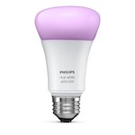
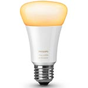
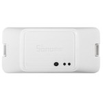
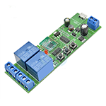
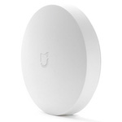

<!-- Shield -->
[ha-version-shield]: https://img.shields.io/badge/Home%20Assistant-2022.7.7-blue.svg
[maintenance-shield]: https://img.shields.io/maintenance/yes/2022.svg
[z2m-shield]: https://img.shields.io/badge/zigbee2mqtt-1.27.0.1-yellow.svg
[ring-alarm-shield]: https://img.shields.io/badge/Security%20Kit-Ring-blue.svg
[zgw-shield]: https://img.shields.io/badge/ZigStar%20-LAN%20GW-green.svg

<!-- Links -->

[home-assistant]: https://home-assistant.io
[z2m-link]: https://www.zigbee2mqtt.io/
[smarthome]: https://github.com/risozhor/ha-config
[smarthomes]: https://github.com/risozhor?tab=repositories&q=ha-config

# ha-config

[![bage][last-commit]][goto]

[last-commit]: https://img.shields.io/github/last-commit/risozhor/ha-config?style=for-the-badge
[goto]: https://www.smarty.ninja/

- 👋 Hi, my name Oleksandr, I'm from Ukraine
- 👀 I’m interested in Web development and Smart Home building ;)
- How to reach me:  
- [][goto] I run my blog about smart home technologies (Ukrainian)
 

[][goto]

 
 
You can support me:
 
  

---
## My current configuration (table is not yet complete)

| Title | Shield |
|:---:|:---:|
| Current Home Assistant that I use | [![HA Version][ha-version-shield]][home-assistant] |
| Current Zigbee2MQTT that I use | [![z2m Version][z2m-shield]][z2m-link] |
| - | ![alarmkit][ring-alarm-shield] |
| - | ![zgw][zgw-shield] |
| - | - |

---
## Devices I use (table is not yet complete)
| Description | Picture |
|:---|---:|
| **Zigbee devices** |
| Hue white and color ambiance E26/E27/E14 |  |
| Hue white ambiance E26/E27 |  |
| - |  |
| - |  |
| - |  |
| - |  |
| - |  |
| - |  |
| - |  |
| - |  |
| - |  |
| - |  |
| - |  |
| - |  |
| - |  |
| - |  |

# Welcome to my Home Assistant configuration

### main screen

### security and air alarms

### door and windows

### lights

### climate

