<!-- Shield -->
[ha-version-shield]: https://img.shields.io/badge/Home%20Assistant-2023.2-blue.svg
[ha-server]: https://img.shields.io/badge/Raspberry%20PI%204-RAM%204%20Gb-red.svg
[maintenance-shield]: https://img.shields.io/maintenance/yes/2022.svg
[z2m-shield]: https://img.shields.io/badge/zigbee2mqtt-1.30-yellow.svg
[ring-alarm-shield]: https://img.shields.io/badge/Security%20Kit-Ring-blue.svg
[zgw-shield]: https://img.shields.io/badge/ZigStar%20-LAN%20GW-green.svg

<!-- Links -->

[home-assistant]: https://home-assistant.io
[z2m-link]: https://www.zigbee2mqtt.io/
[smarthome]: https://github.com/risozhor/ha-config
[smarthomes]: https://github.com/risozhor?tab=repositories&q=ha-config

# ha-config
 
[![bage][last-commit]][goto]

[last-commit]: https://img.shields.io/github/last-commit/risozhor/ha-config?style=for-the-badge
[goto]: https://www.smarty.ninja/

- 👋 Hi, my name Oleksandr, I'm from Ukraine
- 👀 I’m interested in Web development and Smart Home building ;)
- How to reach me:  
- [][goto] I run my blog about smart home technologies (Ukrainian)
 

[][goto]

  
 
You can support me:
 
  

---
## My current configuration (table is not yet complete)

| Title | Shield |
|:---|:---|
| Current Home Assistant that I use | [![HA Version][ha-version-shield]][home-assistant] |
| Current server based on | [![HA server][ha-server]][home-assistant] |
| Current Zigbee2MQTT that I use | [![z2m Version][z2m-shield]][z2m-link] |
| Alarm kit | ![alarmkit][ring-alarm-shield] |
| Zigbee gateway | ![zgw][zgw-shield] |
| - | - |

---
## Below is a list of hardware in-house (table in spoiler)

  
Show list in table

| Description | Picture |
|:---|---:|
| *Zigbee devices* ||
| Hue white and color ambiance E26/E27/E14 |  |
| Hue white ambiance E26/E27 |  |
| Aqara door & window contact sensor |  |
| Aqara Opple switch 2 bands |  |
| Aqara single key wireless wall switch |  |
| SONOFF BASIC ZBR3 Zigbee DIY Smart Switch |  |
| Gledopto GL-C-007-1ID |  |
| Mi power plug ZigBee EU |  |
| MiJia door & window contact sensor |  |
| MiJia temperature & humidity sensor |  |
| Xiaomi Mijia Human Body Sensor  |  |
| SmartThings Motion sensor |  |
| Tuya smart zigbee 2ch relay module |  |
| Xiaomi Smart Wireless Switch |  |
| Xiaomi Honeywell fire detector |  |
| Zigbee smart energy meter DDS238-2 |  |
| *WiFi devices* ||
| Amazon Echo Dot 4th gen  | 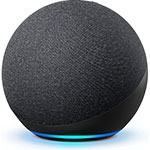 |
| Amazon Echo Show 8 (2nd Gen) |  |
| Foscam-C2 | 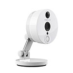 |
| Google Home Mini | 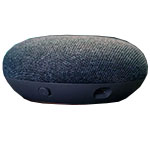 |
| Google Nest Hub (1st-Gen) | 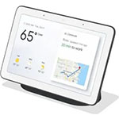 |
| Gyver lamp  [Rewiev](https://www.smarty.ninja/settings/%d0%b4%d0%be%d0%b4%d0%b0%d1%94%d0%bc%d0%be-gyver-lamp-%d0%b2-home-assistant-%d1%82%d0%b0-google-home) |  |
| Nest Learning Thermostat 3rd-Generation | 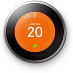 |
| Alarm Security Kit, 5 piece (2nd Gen) | 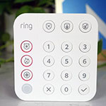 |
| Ring-Chime | 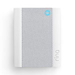 |
| Ring doorbell wired | 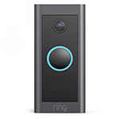 |
| shelly 1 |  |
| Wyze cam v3 | 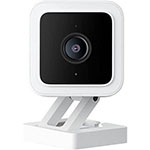 |
| Xiaomi mi air purifier 3h | 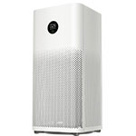 |
| *not so smart but important devices* ||
| Argon One M.2 Case for Raspberry 4 and m2 SSD| 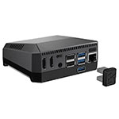 |
| ATIS Lock SS  [Rewiev](https://www.smarty.ninja/hard/access-control/%d0%b5%d0%bb%d0%b5%d0%ba%d1%82%d1%80%d0%be%d0%bc%d0%b5%d1%85%d0%b0%d0%bd%d1%96%d1%87%d0%bd%d0%b8%d0%b9-%d0%b7%d0%b0%d0%bc%d0%be%d0%ba-atis-lock-ss/) and [How to integrate an electromechanical lock into Home Assistant](https://www.smarty.ninja/hard/access-control/atis-lock-into-home-assistant/) | 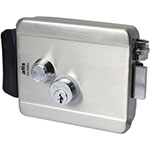 |
| MikroTik RB4011iGS+5HacQ2HnD-IN router  | 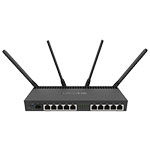 |
| Tecsar Trek SA TS21 controller  [Rewiev](https://www.smarty.ninja/hard/access-control/tecsar-trek-sa-ts21/) | 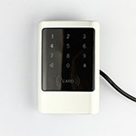 |

 

# Welcome to my Home Assistant configuration

| Mobile view  | Telegram bot |
| ------------- | ------------- |
|<video src="https://user-images.githubusercontent.com/12980782/224554395-f9f35544-1e7a-4dd5-b38d-afa82137f232.mp4">  |<video src="https://user-images.githubusercontent.com/12980782/224554851-c754417a-43d7-44d6-a952-3dc4d0e6fe3b.mp4">  |

### main screen
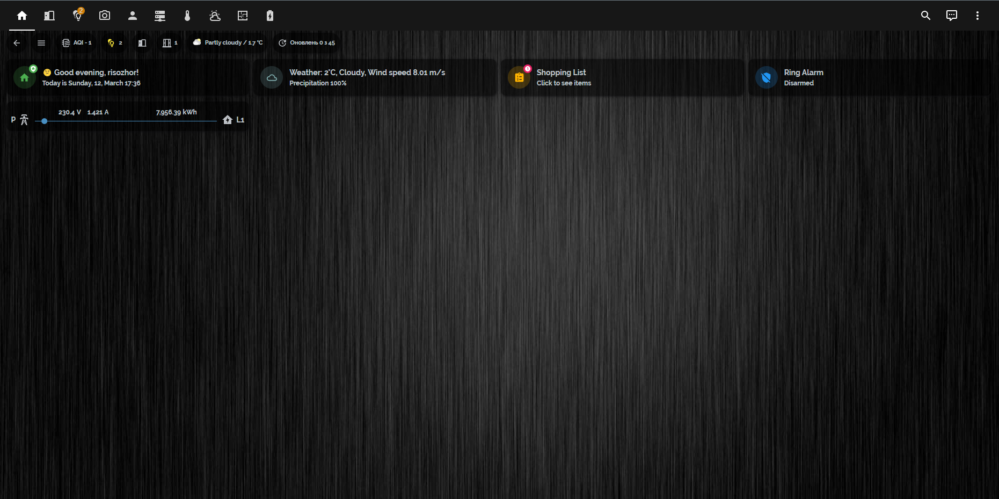

### door and windows
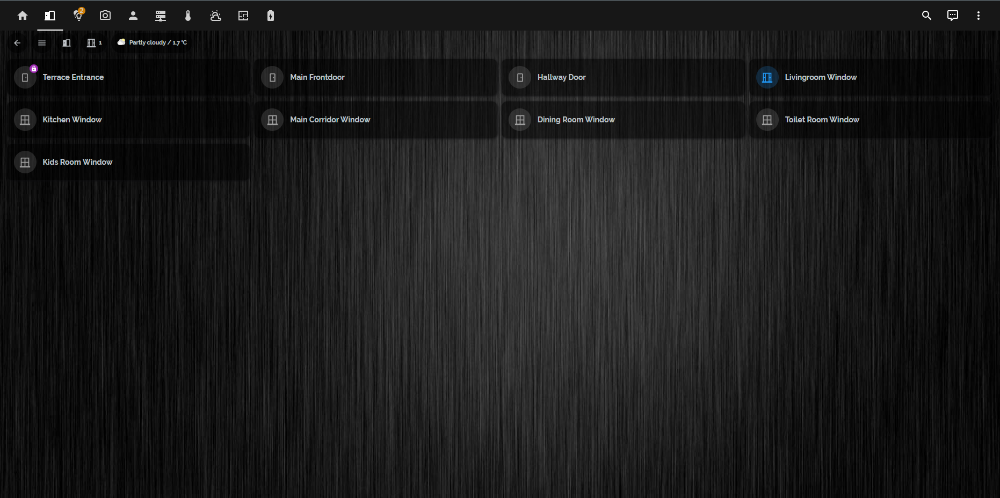

### rooms (lights)
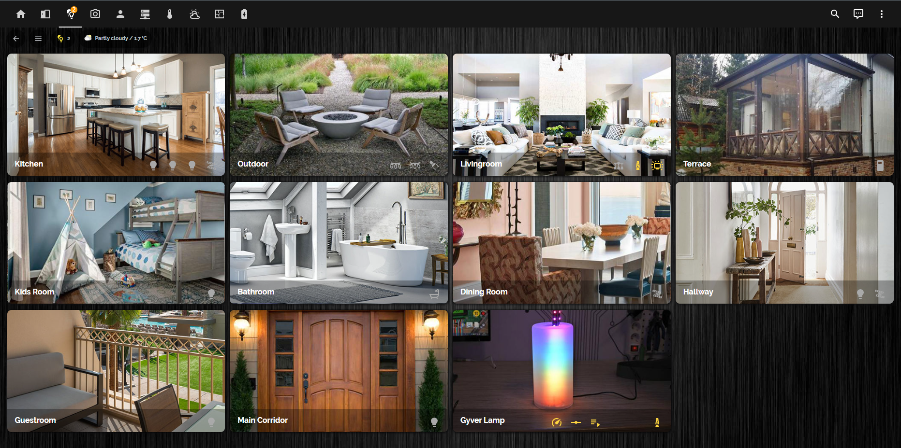

### hardware
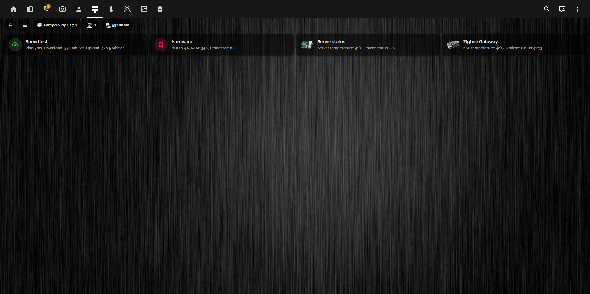

### Weather
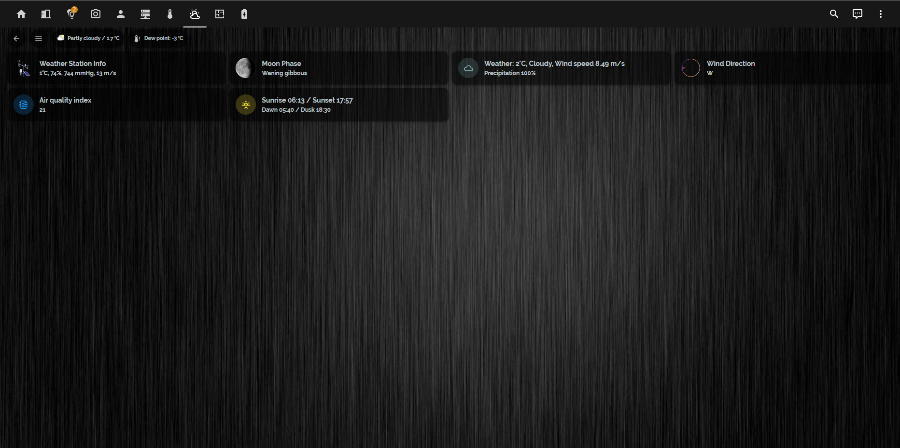

### Floorplan
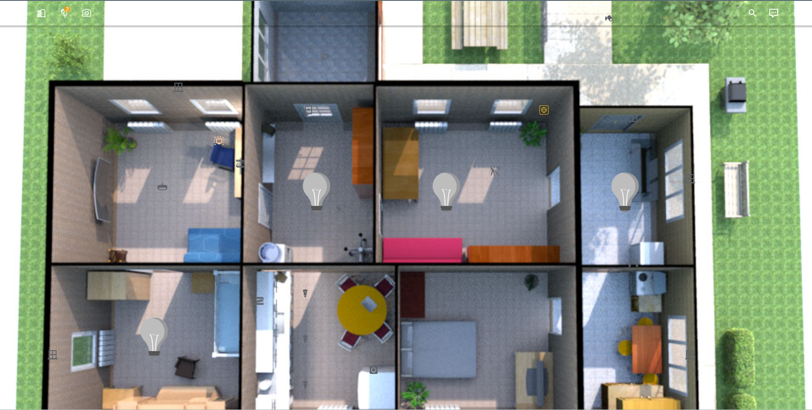
